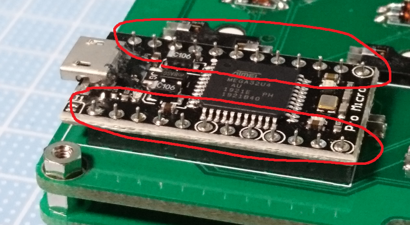
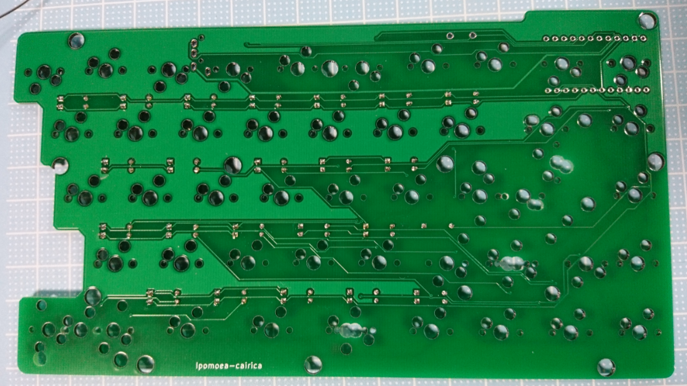
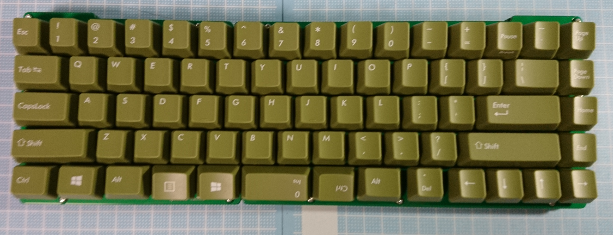

# Ipomoea-cairica の組み立て方

## キットに含まれているパーツ

|数|パーツ名|補足等|
|--|--|--|
|1枚|Ipomoea-cairica-top_LEFT(PCB)|一番上につけるキースイッチを固定するための板(左側)|
|1枚|Ipomoea-cairica-top_RIGHT(PCB)|一番上につけるキースイッチを固定するための板(右側)|
|1枚|Ipomoea-cairica-board_LEFT(PCB)|パーツ・スイッチをつける基板(左側)|
|1枚|Ipomoea-cairica-board_RIGHT(PCB)|パーツ・スイッチをつける基板(右側)|
|1枚|Ipomoea-cairica-bottom_LEFT(PCB)|boardの下につける板(左側)|
|1枚|Ipomoea-cairica-bottom_RIGHT(PCB)|boardの下につける板(右側)|
|2枚|Ipomoea-cairica-bottom2under_LEFT(PCB)|bottomの下につける板(左側)|
|2枚|Ipomoea-cairica-bottom2under_RIGHT(PCB)|bottomの下につける板(右側)|
|1枚|Ipomoea-cairica-under_LEFT(PCB)|underの下につける板(左側)|
|1枚|Ipomoea-cairica-under_RIGHT(PCB)|underの下につける板(右側)|
|20本|M2スペーサー 7mm|[購入](https://www.hirosugi-net.co.jp/shop/g/g65)|
|34本|M2ネジ 4mm|[購入](https://www.hirosugi-net.co.jp/shop/g/g36905/)|
|6本|M2ネジ 10mm|underのねじ止め用 [購入](https://www.hirosugi-net.co.jp/shop/g/g36909/)|
|8個|ゴム足|3mm 程度の高さが必要 [購入(例)](http://akizukidenshi.com/catalog/g/gP-11222/)|
|2個|タクトスイッチ|[購入](http://akizukidenshi.com/catalog/g/gP-08073/)|
|2個|MJ-4P-9|[購入](http://akizukidenshi.com/catalog/g/gC-06070/)|
|80個|ダイオード(1N4148)|予備6個 左手29個 右手45個[購入(秋月)](http://akizukidenshi.com/catalog/g/gI-00941/) [購入(TALP KEYBOARD)](https://talpkeyboard.stores.jp/items/59eadbffc8f22c15de001638)|
|80個|PCBソケット(MX用)|JP(左29:右43)US(左29:右42)[購入(遊舎工房)](https://yushakobo.jp/shop/a01ps/) [購入(TALP KEYBOARD)](https://talpkeyboard.stores.jp/items/5e02c5405b120c792616bcf9)|
|4個|2U スタビライザー|JP(3個)US(4個)[購入(遊舎工房)](https://yushakobo.jp/shop/a0500st/)|


## キットに含まれておらず、追加で購入が必要なパーツ
|数|パーツ名|補足等|
|--|--|--|
|2個|ProMicro|遊舎工房のコンスルーセットのものを購入すればコンスルーの追加購入は不要<br>[購入(遊舎工房)](https://yushakobo.jp/shop/promicro-spring-pinheader/) [購入(TALP KEYBOARD)](https://talpkeyboard.stores.jp/items/5b24504ba6e6ee7ec60063e3)|
|2個|コンスルー(12ピン 2.5mm)|ProMicro用(コンスルー以外では部品が干渉する可能性があります)<br>[購入(TALP KEYBOARD)](https://talpkeyboard.stores.jp/items/5e056626d790db16e2889233) [購入(遊舎工房)](https://yushakobo.jp/shop/a01mc-00/)|
|72個(JP)<br>71個(US)|キースイッチ|お好みで|
|1セット|FICO Majestouch 全体交換用キーキャップ(日本語 or 英語)|FICO Majestouch 全体交換用キーキャップに合わせて設計しているためこちらのキーキャップセットがおすすめです<br>[購入(DIATEC)](https://www.diatec.co.jp/shop/list.php?s[]=100:1002:10008)|

## 組み立てに必要な工具

* はんだこて
* はんだ
* 精密ドライバー
* ニッパー

## あると便利な工具

* マスキングテープ
* キースイッチプラー

ほかの工具については「自作キーボード 工具」と調べるといいかもしれません

## 組み立て

まず左手側から組み立てていきます

基本的に部品はシルク（白い線）が書かれている方につけます。

組立予想図(JP配列)


組立予想図(US配列)


### ダイオードをはんだ付けします

基板の下記画像のシルクの箇所にダイオードをつけていきます。


三角形と縦線を組み合わせた形になっているので、シルクの縦線側(四角いスルーホール)に1N4148の黒線（カソード）を合わせるように差し込んでいきます。


**ダイオードが浮かないようにはんだ付けする前にマスキングテープなどで固定することをお勧めします**

ダイオードの差し込み後はんだ付けしていきます。


はんだ付け後は余分な足を切ります。


### Kailh PCBソケットをつけます

このシルクの箇所に


このように取り付けます


逆につけてしまうとキースイッチが入らなくなってしまうため、シルクの形の通りにソケットを取り付けます。
(中央の固定用穴が干渉してしまいます)


**JP配列かUS配列のどちらで作るかによって、つけてはいけない箇所があります**

#### 左手側をJP配列で作成する場合

JIS と記載されている箇所にソケットをつけます。


#### 左手側をUS配列で作成する場合

US と記載されている箇所にソケットをつけます。


ソケットをすべてつけ終わるとこのようになります(JP配列の場合)


### TRRSジャックとタクトスイッチをつけます

浮かないようにマスキングテープ等で固定してからはんだ付けすることをお勧めします。


### コンスルーとProMicroをつけます

**コンスルーはProMicro側のみはんだ付けします**

基板側をはんだ付けしないことによりいつでも抜くことができるようにすることでメンテナンスしやすくするための部品です。

コンスルーは横から銅が飛び出している箇所（窓）が一方にあります。

窓は同じ向きにします。

また、窓は上下に寄っています。

窓が基板から離れている向きで基板に差し込みましょう。


ProMicroはATmega32U4（マイコン）を基板と逆側に向けてつけます。

マイコンを基板側に向けてしまうとソケットと干渉してしまうため注意しましょう。

また、図のProMicroのようにモゲ防止をしておくと良いでしょう。


浮かないように注意しながらProMicro側だけをはんだ付けしていきます。



左手側のはんだ付けが完了しました。
ここでProMicroにファームウェアを書き込んで軽く動作確認すると、右手側も安心して組み立てられるかもしれません。

### 右手側を組み立てます

組立予想図(JP配列)


組立予想図(US配列)


### ダイオードをはんだ付けします

左手と同様にダイオードをつけていきます


差し込み終わったらはんだ付けして余分な足は切断します。



### Kailh PCBソケットをつけます


JP配列の場合

**JP配列かUS配列のどちらで作るかによって、つけてはいけない箇所があります**

#### 右手側をJP配列で作成する場合


この画像のように、JISと記載されている箇所にソケットをつけます。

#### 右手側をUS配列で作成する場合

この画像のように、USと記載されている箇所にソケットをつけます。

**rev.1(r.1)のTOPプレートにはミスがあるためUS配列でも右下はJISと記載された箇所にソケットをつけてください**


### TRRSジャックとタクトスイッチをつけます


### コンスルーとProMicroをつけます


### 組み立てていきます


左手側は下から
  + Ipomoea-cairica-under_LEFT
  + Ipomoea-cairica-bottom2under_LEFT
  + Ipomoea-cairica-bottom2under_LEFT
  + Ipomoea-cairica-bottom_LEFT
  + Ipomoea-cairica-_LEFT

右手側は下から
  + Ipomoea-cairica-under_RIGHT
  + Ipomoea-cairica-bottom2under_RIGHT
  + Ipomoea-cairica-bottom2under_RIGHT
  + Ipomoea-cairica-bottom_RIGHT
  + Ipomoea-cairica-_RIGHT

となるように載せていきます。


このように積み重ねて7mmのスペーサーをねじ止めします


画像のように、上側は10mmのねじ、それ以外は4mmのねじを使用します。


スペーサーをつけたらはんだ付けしていたPCBを上に載せます


スタビライザーを装着します（US配列）


トッププレートを上に載せて4mmのねじで止めます。


### キースイッチをつけます


キースイッチの接点がソケットに挿し込まれるように向きに気をつけましょう


### ファームウェアを書き込みます

qmk firmware については[こちら](https://docs.qmk.fm/#/ja/)のリンクを参照してください。

このキーボードはqmk firmwareの本家に組み込まれていないため、`https://github.com/qmk/qmk_firmware`となっている箇所は`https://github.com/okzo/qmk_firmware`に置き換えてください。

* 簡単な手順
  - msys2 もしくは wsl をインストールして起動します
  - git をインストールします
  - `https://github.com/okzo/qmk_firmware.git`をcloneします
    ```
    git clone --recurse-submodules https://github.com/okzo/qmk_firmware.git
    cd qmk_firmware
    ```
  - ブランチ`ipomoea_cairica`をチェックアウトします
    ```
    git checkout -b ipomoea_cairica origin/ipomoea_cairica
    ```
  - `\util\qmk_install.sh`を実行します
  - インストールが終わったらqmk_firmwareのディレクトリ上で`make ipomoea_cairica:default`と実行します
    + US配列の場合は`make ipomoea_cairica:us`と実行します
  - `ipomoea_cairica_default.hex`ができているので[QMK Toolblx](https://github.com/qmk/qmk_toolbox)をダウンロードしてOpenします
  - 先ほど組み立てた左手側のProMicroに書き込みます
  - 書き込んだらキーが入力できるかを確認しましょう


### キーキャップをつけます



### ゴム足をつけます


### 完成です！


